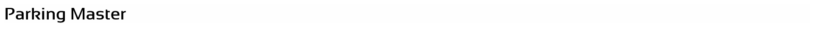

# Parking Master
> Parking Master is a fun web-game, and desktop application.<br>
> You can play it by installing the desktop app or going to<br>
> https://parkingmaster.w3spaces.com/
##### - For further releases, please skip to the <a href="#further-releases-1">Further Releases</a> section.
##### - To contact us for bugs, email us at <a href="mailto:parkingmaster@email.com">parkingmaster@email.com</a>.
## Parking Master desktop app released!
An all-new parking master desktop application.<br>
You can follow instructions below to install it.<br>
## ➖ Installing it
&#707; Windows 10 via <a href='https://www.npmjs.com/'>NPM:</a>
```
$ npm install Parking-Master
```
## ➖ Launch the application
```
$ cd Parking-Master
$ npm start
```
### Parking Master v.1.1.0 coming September 21st 2021!
v.1.1.0 is coming so soon it already has a release date,<br>
and a features list. Information is below.

Version: `'v.1.1.0'`,<br>
Date: `'9/21/21'`,<br>
Features:
```
'Multiplayer,'
'Signup/Login,'
'Profiles/Accounts,'
'Bugs/Serious Fixes,'
'jQuery PKG added,'
'Bootstrap added,'
'New styles'
```
<hr>


## Features:
| Feature | Version | Date |
| --------------| ------------- | ------------- |
| Multiplayer:  | v.1.1.0 | (None) |
| Profile/Accounts:  | v.1.1.0 | (None) |
| New levels:  | (None) | [F/M.R](learn-more.html#fmr-1) |

## How to play
> Parking Master is a simple web-based<br>
> Car parking game. Anyone can play.
> 
> 1. Drive into the outlined spot
> 2. Click The "P" Button located near the shifter
> 3. Continue by pressing 'close' and repeat with remaining levels.

## Further Releases
| Version | Date |
| ------- | ---- |
| v.1.0.0 | 8/1/21 |
| v.1.1.0 | 9/21/21 |
| v.1.2.1 | 10/5/21 |
| ....... | --/--/-- |
<hr>



###### Sources:
<kbd><a href='https://parkingmaster.w3spaces.com/'>parkingmaster.w3spaces.com</a></kbd> <kbd><a href='index.html'>Parking Master | GitHub</a></kbd>
